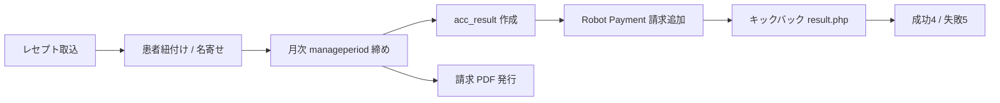

# システム俯瞰（System Map）

## 1. 環境と URL / フォルダ対応

| 科目 | 役割 | URL | リポジトリ内フォルダ | DB 名（現行） |
|------|------|-----|----------------------|---------------|
| 歯科 | 本番 | https://dx.clinic-payment.com/ | `dx/` | `xs547384_dx` |
| 歯科 | DEV | https://dxdev.clinic-payment.com/ | `dxdev/` | `xs547384_dxdev` |
| 内科（医科） | 本番 | https://im.clinic-payment.com/ | `im/` | `xs547384_improd` |
| 内科（医科） | DEV | https://imdev.clinic-payment.com/ | `imdev/` | `xs547384_im` |
| 薬科 | 本番 | https://ph.clinic-payment.com/ | `ph/` | `xs547384_ph` |
| 薬科 | DEV | https://phdev.clinic-payment.com/ | `phdev/` | `xs547384_phdev` |

各フォルダは **ほぼ同型の PHP アプリを複製**した構成。差分の中心は DB 名、レセプト取込、診療カテゴリ、決済識別子 `cod` の接頭辞。

`class/config.php` の `DOMAIN` 定数は現状すべて `cldeploy.netstars.vision`（実 vhost の clinic-payment.com 系とは別系統のレガシー値の可能性あり。PDF パス等で参照）。

## 2. 1 環境あたりのディレクトリ役割

```
{dx|im|...}/
  index.php                 # 管理側ログイン
  index_hospital.php        # 医療機関側ログイン
  manager/                  # Web UI・月次バッチ・決済コールバック
  class/                    # 業務ロジック（clsystem.php）、config.php
  common/                   # DB 接続、Smarty 設定
  libs/                     # テンプレート等
  pdf/ / downloadpdf/       # PDF 関連
  PHPMailer/ / vendor/      # 依存ライブラリ
```

### エントリの二系統

| 系統 | 入口 | 認証 | 主な権限 |
|------|------|------|----------|
| Manager（運営） | `index.php` → `manager/verifylogin.php` | `_cms_account` | 取込・締め・請求・口座・名寄せなど全機能 |
| Hospital（医療機関） | `index_hospital.php` | `account_info` | 自院患者一覧など縮小権限 |

## 3. 主要業務フロー（科目共通の骨格）



| 領域 | 代表ファイル | 備考 |
|------|--------------|------|
| 歯科レセプト取込 | `dx/manager/recept-upload-008.php` | 歯科フォーマット |
| 医科レセプト取込 | `im/manager/recept-upload-im.php` | 医科フォーマット（別パーサ） |
| 介護レセプト | `*/manager/kaigo-recept-upload-003.php` | dx/im 双方に存在 |
| 自由診療 | `*/manager/appendix*.php` | `appendix` テーブル |
| 患者・口座 | `*/manager/patient_info.php` 等 | `patient_info.rp_cid` が決済顧客番号 |
| 口座顧客登録 | `*/manager/payment-test-exe.php` | Robot Payment `cmd=1` |
| 月次締め | `*/manager/_batch_manageperiod_step{1-8}.php` | 下記 |
| 決済送信 | `*/manager/_batch_manageperiod_step3.php` | 各システムから送信 |
| 決済結果 | **`dx/manager/result.php` のみが本番の振り分け拠点** | 詳細は [02-robot-payment.md](./02-robot-payment.md) |
| PDF | `CLSYSTEM::generatePDF` 等 / `generate-receipt-all-pdf_*.php` | |

## 4. 月次 manageperiod（概要）

ジョブ進行は `manageperiod` テーブル、明細側は `re_shinryo` / `rek_service` / `appendix` の `manageperiod_status`。

**ブラウザ運用（2026-08 追加）**: `manager/closing.php`（締めダッシュボード）と `manager/backup.php`（data-only バックアップ／確認コード付きリストア）。メニューからも遷移可能。CLI の `_batch_manageperiod_step*.php` と同等の処理を段階ボタンで実行する。step6 は廃止。

### 明細の `manageperiod_status`（コードから推定）

| 値 | 意味 |
|----|------|
| 0 | 未処理（取込直後） |
| 1 | 当月締め対象に割当 |
| 2 | `acc_result` 作成済み（ロボペイ未送信〜送信直後） |
| 3 | 請求追加後・振替結果待ち |
| 4 | 振替成功（または口座振替以外を成功扱い） |
| 5 | 振替失敗 → 翌月繰越候補 |

### バッチ step 対応

| Step | ファイル | 内容 |
|------|----------|------|
| 1 | `_batch_manageperiod_step1.php` | 対象割当 |
| 2 | `_batch_manageperiod_step2.php` | `generateRPdata` → `acc_result` / `acc_detail` |
| 3 | `_batch_manageperiod_step3.php` | Robot Payment へ請求追加（`cmd=2`） |
| 4 | `_batch_manageperiod_step4.php` | PDF 等の後処理、結果待ちへ |
| 5 | `_batch_manageperiod_step5.php` | 口座振替以外を成功扱い等 |
| 6〜8 | step6 / 7 / 8 | エラー繰越・月次クローズ |

## 5. 主要テーブル（決済・請求まわり）

| テーブル | 役割 |
|----------|------|
| `acc_result` | 注文単位。`cod` / `am` / `reqid` / `gid` / `rst` / `rp_*` / `targetym` / `original_pid` |
| `acc_detail` | 請求明細スナップショット |
| `patient_info` | 患者。`rp_cid`, `direct_debit` |
| `re_shinryo` | 医療保険明細 + manageperiod 系カラム |
| `rek_service` / `rek_patient` | 介護保険 |
| `appendix` | 自由診療 |
| `manageperiod` | 月次ジョブ進行 |
| `rp_schedule` | ロボペイ振替スケジュール（次回 `transfer_date`） |
| `_cms_account` / `account_info` | 管理ログイン / 医療機関ログイン |

## 6. 設定の置き場

| ファイル | 内容 |
|----------|------|
| `{env}/class/config.php` | `DBNAME`, `AID`, `TDAY`, `BILLINGSTATUS`, `SERVICETITLE`, `$m_category`, エラー辞書 |
| `{env}/common/database.php` | PDO の実 DB 名（ここも環境ごとに異なる） |
| `{env}/libs/common/database.php` | 旧 MDB2 用接続 |
| `{env}/class/common.php` | ログイン用 PDO |

MySQL ユーザーは本番系統で `xs547384_dx` を共有している箇所が多い（dxdev のみ別ユーザー）。クローン時は接続文字列を漏れなく洗うこと。

## 7. 設計上の大前提（拡大時に崩さないこと）

1. **科目ごとにアプリフォルダ + DB を分ける**（コードコピー運用）
2. **Robot Payment は店舗を共有し、キックバックは 1 URL**（現状は dx 本番）
3. **システム識別は店舗オーダー番号 `cod` の先頭 2 文字**（`im` / 将来 `ph`。歯科は接頭辞なし＝デフォルト）
4. 科目固有の最大コストは **レセプトパーサとカテゴリ／PDF** 側
