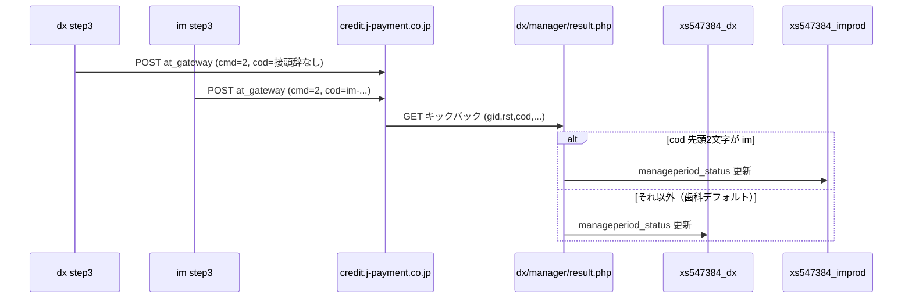

# ロボットペイメント連携（横断関心事）

手離れ後に最も不安になりやすい箇所。**送信は各科目から、結果通知は 1 URL** という構造になっている。

## 1. 全体像



| 方向 | 誰が | どこへ |
|------|------|--------|
| 請求追加（送信） | 各科目の `_batch_manageperiod_step3.php` | `https://credit.j-payment.co.jp/gateway/at_gateway.aspx` |
| 振替結果（受信） | Robot Payment | **実質 `dx/manager/result.php` のみ**（本番の振り分け拠点） |

Robot Payment 管理画面側のキックバック URL 設定が、この dx 本番 URL を指している前提。

## 2. なぜ接頭辞で振り分けるか

店舗（`AID=115106`）を科目間で共有しているため、キックバック先を科目ごとに分けられない（または分けていない）。  
代わりに **店舗オーダー番号 `cod` に科目接頭辞を埋め込み**、`result.php` が DB を切り替える。

### `cod` の規則

| 科目 | 生成箇所 | 形式 | `substr($cod, 0, 2)` |
|------|----------|------|----------------------|
| 歯科 (dx) | `dx/class/clsystem.php` `generateRPdata()` | `{irkkcode}-{pid7}-{YYYYMM}-{uniqid}` | `im` 以外 → dx DB |
| 内科 (im) | `im/class/clsystem.php` `generateRPdata()` | `im-{irkkcode}-{pid7}-{YYYYMM}-{uniqid}` | `im` → improd DB |
| 薬科 (ph) | `ph/class/clsystem.php`（`COD_PREFIX`） | `ph-{irkkcode}-{pid7}-{YYYYMM}-{uniqid}` | `ph` → `xs547384_ph` |

判定コード（本番 dx）:

```php
// dx/manager/result.php
$codPrefix = substr($cod, 0, 2);

if ($codPrefix === 'im') {
    $dbName = 'xs547384_improd';
} elseif ($codPrefix === 'ph') {
    $dbName = 'xs547384_ph';
} else {
    $dbName = 'xs547384_dx';
}
```

**重要:** 先頭 2 文字比較なので、接頭辞は `ph-` / `im-` のように **2 文字 + ハイフン** が既存ルールと整合する。  
歯科に接頭辞がないため、「未登録の接頭辞」はすべて歯科 DB に落ちる。薬科で `ph-` を付け忘れると **歯科データが汚染される**。

## 3. 送信（step3）の要点

ファイル例: `dx/manager/_batch_manageperiod_step3.php`（im も同型）

1. `rp_schedule` から次回 `transfer_date` を取得
2. `acc_result` のうち未送信（`reqid IS NULL`）かつ `patient_info.rp_cid` あり・`direct_debit = 0`・`rp_disableflag = 0` を抽出
3. POST パラメータ例:
   - `aid` = `AID`（115106）
   - `cmd` = `2`（請求追加）
   - `tday` = `TDAY`（コメント上「1＝10日」）
   - `cid` = 顧客番号（`rp_cid`）
   - `amo` = 金額
   - `date` = 振替日
   - `type` = 1（単発）
   - `stat` = `BILLINGSTATUS`
   - `cod` = 店舗オーダー番号
4. 成功時: 応答の請求 ID を `acc_result.reqid` および明細側 `rp_reqid` に保存
5. 失敗時（応答先頭 `ER`）: `rp_errorflag` / `rp_errormsg` を記録

顧客登録は別フロー（`payment-test-exe.php` の `cmd=1`）で行い、成功時に `patient_info.rp_cid` を保存する。

## 4. 受信（result.php）の要点

キックバック GET パラメータ（抜粋）: `gid`, `rst`, `ap`, `ec`, `god`, `cod`, `am`, `tx`, `sf`, `ta`, `em`, `nm`

| 条件 / 値 | 動作 |
|-----------|------|
| `god != 0` | 即終了 |
| `rst = 1` | 成功扱い → `manageperiod_status = 4`、`rp_errorflag = 9` |
| `rst = 2` | 失敗扱い → `manageperiod_status = 5`、`rp_errorflag = 1` |

更新対象（いずれも現状 `manageperiod_status = 3` のもの）:

- `re_shinryo`
- `rek_service`
- `appendix`
- `acc_result`（キックバック項目を反映）

処理後、運用者へメール通知（PHPMailer。認証情報はソース直書き）。

## 5. 環境ごとの result.php の差

| ファイル | 振り分け |
|----------|----------|
| **`dx/manager/result.php`** | **あり**（`im` / それ以外）。本番の共有入口 |
| `im/manager/result.php` | なし（自 DB のみ） |
| `dxdev/manager/result.php` | なし（自 DB のみ） |
| `imdev/manager/result.php` | なし（自 DB のみ） |

DEV でロボペイのキックバックを使う場合は、別 URL・別ルーティングが必要か、本番と共有するか、運用方針を明示して決めること。

## 6. 手動 CSV 取込（補助）

- im: `im/manager/csv-upload.php` — `cod` 先頭が `im` 以外はスキップ
- dx: `__NOUSE__csv-upload.php` — 無効化命名

薬科で同様の手動取込を持つなら、接頭辞フィルタを `ph` に合わせる。

## 7. 薬科追加時の必須変更（決済だけに限定）

1. `ph` / `phdev` の `generateRPdata`（および DEBUG / irregular 系すべて）で `cod` を `ph-...` にする
2. **`dx/manager/result.php` に `ph` 分岐を追加**（ここを忘れると全件 dx DB）
3. DB 名（例: `xs547384_phprod` / `xs547384_ph`）を決定し接続設定と分岐先を一致させる
4. 同一 `AID` を使い続けるか、店舗を分けるかを Robot Payment 側と合意する（分ける場合はキックバック URL 設計も再検討）
5. CSV 手動取込を使うなら接頭辞フィルタを追加

## 8. 既知の注意点

- im の `generateRPdataDEBUG` 等に **`im-` 未付与**の経路がある。本番 `generateRPdata` と不一致
- 歯科は接頭辞なしのため、**未知の接頭辞はすべて歯科に振り分けられる**
- パスワード・SMTP がソースに直書きされている（docs には値を記載しない）
